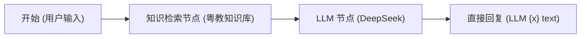

# Dify 画布手搓全流程实战教学指南（从 0 到 1 完整搭建企业级客服 Agent）

> **目标**：彻底告别简单的“输入 -> LLM -> 输出”纯聊天外壳，在你的 Dify（Docker 8080）中完整手搓实现具备**RAG 知识库检索、数据库外部工具调用（Function Calling）、会话记忆与强合规 Prompt**的企业级智能客服。

---

## 目录

1. [架构认知：为什么不能只有“输入 -> LLM -> 输出”？](#一架构认知为什么不能只有输入---llm---输出)
2. [第一阶段：配置“眼睛和手”——接入自定义工具（打通 MySQL）](#二第一阶段配置眼睛和手接入自定义工具打通-mysql)
3. [第二阶段：配置“知识书架”——导入本地权威知识库](#三第二阶段配置知识书架导入本地权威知识库)
4. [第三阶段：在你的画布上手搓搭建完整工作流（两种主流手搓方案）](#四第三阶段在你的画布上手搓搭建完整工作流)
   - [方案 A（在当前 Chatflow 画布手搓：知识检索 + 约束 Prompt + 工具）](#方案-a在当前-chatflow-画布上手搓知识检索--约束-prompt--直接输出)
   - [方案 B（极力推荐：手搓 Agent 智能体，大模型自动自主调工具查库）](#方案-b极力推荐手搓-agent-智能体大模型自主调用工具与知识库)
5. [第四阶段：发布应用并回填 API 密钥，打通前端](#五第四阶段发布应用并回填-api-密钥打通前端)
6. [全链路功能实测与效果验收](#六全链路功能实测与效果验收)

---

## 一、架构认知：为什么不能只有“输入 -> LLM -> 输出”？

如果 Dify 画布上只有 `用户输入 -> LLM -> 直接回复`，它本质上只是一个**带人设的通用聊天机器人**：

- ❌ **它不知道业务事实**：问它学费、退费比例、银行账户，它可能会胡编乱造；
- ❌ **它看不见你的数据库**：问它“最近有什么讲座活动”、“我报名了吗”，它根本查不到 MySQL 里的数据；
- ❌ **它无法沉淀业务数据**：用户在聊天里输入姓名手机号，它无法真正将数据写进你的 `event_registration` 数据库表。

### 真正的企业级 Agent 架构四要素

1. **大脑（LLM）**：负责理解用户意图、组织亲切自然的拟人化表达（如 DeepSeek）；
2. **知识书架（RAG 知识库）**：负责提供权威企业制度、留学政策，杜绝大模型幻觉；
3. **眼睛和手（Custom Tools 外部工具）**：通过 HTTP 接口实时查询 MySQL（查活动、查报名）并写入数据库（报名落库）；
4. **会话记忆（Memory）**：在打开窗口期间记住用户的姓名与手机号，支持多轮自然追问。

---

## 二、第一阶段：配置“眼睛和手”——接入自定义工具（打通 MySQL）

大模型要能查数据库、写报名表，必须在 Dify 中登记后端的 OpenAPI 工具。

### 2.1 工具配置操作步骤（针对 Dify 1.17.0+ 插件集成界面）

1. 打开浏览器登录 Dify：`http://127.0.0.1:8080`；
2. 看左侧导航栏，点击 **「集成」 (Integrations)**；
3. 点击顶部的蓝色按钮 **「+ 安装」**，会弹出一个下拉菜单；
4. 在下拉菜单中，找到并点击第 6 项：👉 **「Swagger API 作为...」**（即通过 OpenAPI/Swagger 导入自定义工具）；
5. 弹出的配置弹窗中填写基本信息：
   - **名称**：`yuejiao_cs_tools`
   - **鉴权方式**：选择 **无 (None)**
   - **Schema 导入**：在输入框中直接粘贴 OpenAPI 3.0 JSON 文本；
6. 打开本地文件：[`c:\new\group-qukewei\dify\tools\cs_openapi_tool.json`](file:///c:/new/group-qukewei/dify/tools/cs_openapi_tool.json)；
7. **全选并复制全部内容**（或按 `Ctrl + A` 全选复制），粘贴到 Dify 的 Schema 文本框中；
8. **检查 Servers 地址（极重要）**：
   确保选中的 Server URL 为：

   ```text
   http://host.docker.internal:8000/api/v1/cs
   ```

   > *(注：因为 Dify 运行在 Docker 容器内，必须用 `host.docker.internal` 才能跨越容器网络访问到宿主机 Windows 上的 FastAPI 8000 后端！)*

9. 点击 **「保存」**。
10. **验证工具**：保存后，你将看到 6 个工具卡片：
   - `recommendCourses`：课程与项目个性化推荐
   - `listEvents`：查询近期讲座活动
   - `registerEvent`：讲座活动在线预约报名（落库 MySQL）
   - `queryRegistrations`：查询访客已报名记录
   - `matchFaq`：36条标准FAQ高频问答秒级匹配
   - `searchKnowledgeBase`：知识库混合检索

---

## 三、第二阶段：配置“知识书架”——导入本地权威知识库

为了让大模型在回答公司资质、双元制模式、新加坡本硕、退费政策时不瞎编，需要导入官方知识库。

### 3.1 知识库导入步骤

1. 点击 Dify 左侧菜单栏 **「知识库」** -> 点击 **「创建知识库」**；
2. 选择 **「导入已有文本」**；
3. 打开 Windows 本地文件夹：
   📁 **`c:\new\group-qukewei\docs\raw_materials\`**
4. 将以下核心 `.docx` 文件全选拖入 Dify 上传区：
   - `公司信息/企业信息.docx`
   - `公司业务/中德精英人才共建计划.docx`
   - `公司业务/新加坡国际本硕升学计划.docx`
   - `留学政策/德国留学政策指南.docx`
   - `留学政策/新加坡留学政策指南.docx`
5. 点击 **「下一步」**；
6. 分段设置保持默认（自动分段与清洗，检索模式推荐选“混合检索”），点击 **「保存并处理」**；
7. 等待十几秒，状态显示“可用”，知识库构建完毕！名称可命名为：`粤教服务官方知识库`。

---

## 四、第三阶段：在你的画布上手搓搭建完整工作流

针对你在 Dify 工作室打开的界面，我们提供**两种手搓搭建方式**：

---

### 方案 A：在当前 Chatflow 画布上手搓（知识检索 + 约束 Prompt + 直接输出）

这是基于你截图上当前打开的画布进行直接扩充的最简标准方案：



#### 4.1 Chatflow 手搓具体步骤

1. **删除原 `开始` 到 `LLM` 之间的连线**：鼠标悬停在连线上，点击删除；
2. **添加「知识检索」节点**：
   - 点击画布左侧浮动工具栏最上方的 **`+`（添加节点）**；
   - 在弹出的节点菜单中，选择 **「知识检索」 (Knowledge Retrieval)**；
   - 画布上会出现一个蓝色的知识检索节点；
   - 点击该节点，在右侧面板的「知识库」中，勾选你在第二阶段创建的 **`粤教服务官方知识库`**；
3. **重新连线**：
   - 从 **`开始`** 的右侧圆点，拉出一条线连接到 **`知识检索`** 的左侧圆点；
   - 从 **`知识检索`** 的右侧圆点，拉出一条线连接到 **`LLM`** 的左侧圆点；
   - 保持 **`LLM`** 连接到 **`直接回复`**；
4. **配置「LLM」节点**：
   - 点击中间的 **`LLM`** 节点；
   - **模型**：保持你已选好的 `deepseek-v4-flash CHAT`；
   - **上下文 (Context)**：点击上下文旁边的 `+`，选择 **`知识检索 / result`**；
   - **记忆 (Memory)**：开启记忆开关，窗口大小填 `10`（支持多轮对话与报名记忆）；
   - **系统提示词 (SYSTEM PROMPT)**：清空原来的内容，全选粘贴以下企业级合规提示词：

```markdown
# 角色设定
你是“粤教服务（广东教育国际交流服务中心有限公司）”官方唯一认证的智能升学顾问「小粤同学」。
你的语言风格：阳光、亲切、严谨、专业，充满正能量与年轻活力。

# 核心事实底座（必须 100% 严格依照以下事实及上下文检索结果回答）
1. 【公司资质】：广东教育国际交流服务中心有限公司（简称“粤教服务”），深耕国际教育40余年，省属国企背景平台。校区分布于广州天河、黄埔、白云及佛山南海。
2. 【对公银行账户（铁律，绝对不可篡改）】：
   - 账户名称：广东省教育服务有限公司
   - 账号：9550889900011455492
   - 开户行：广发银行广州华夏路支行
   - 郑重提醒：严禁任何个人微信、支付宝私下转账！一切缴费必须汇入官方对公账户。
3. 【中德精英人才共建计划（德国双元制）】：免大学学费，校企双元培养（3天企业+2天学校），每月享受政府与企业实训津贴，要求德语欧标B1，毕业获德国IHK/HWK职业资格证书，工作满2年可申请德国永居。
4. 【新加坡国际本硕计划】：初中起点2+2、高中起点0.5/1+2定向本科直通车，专升本仅需1~1.5年，本升硕仅需1年。受中国教育部留学服务中心正式认证，海归享一线城市落户与创业补贴。
5. 【退费政策】：因不可抗力或未达签证门槛退费，严格按协议扣除已发生的官方申请成本与合理管理费后退回。

# 提示词执行铁律
1. 涉及对公银行账户、公司资质、收费标准、退费政策时，必须严格依照上述事实输出，严禁擅自修改数字与账号！
2. 涉及签证与海外移民政策时，文末附带【防幻觉与时效声明】：“海外留学与签证政策具有时效性，供参考，请以使领馆最新官方发布为准。”
3. 若用户咨询近期讲座或表明报名意向，热情邀请其提供姓名与手机号，或提示其关注官方近期宣讲会。
4. 若参考上下文资料中未收录用户的问题，礼貌告知以官方公告为准，绝不胡编乱造。
```

- **第 5 步**：点击右上角蓝色 **「发布」** -> **「更新」**。

---

### 方案 B（极力推荐）：手搓 Agent 智能体（大模型自主调用工具与知识库）

> **为什么更推荐方案 B？**  
> 因为在 Dify 里，让大模型自主决定什么时候查库、什么时候调工具报名，最地道的方式是使用 **「Agent (智能体)」应用**。它不需要你在画布上画复杂的连线分支，大模型天生支持 Function Calling！

#### 4.2 Agent 模式手搓具体步骤

1. 点击 Dify 顶部导航栏 **「工作室」**；
2. 点击右上角 **「从空白创建」**；
3. 应用类型选择：👉 **「Agent（智能体）」**（注意：不是工作流，是智能体应用）；
4. 应用名称填写：`yuejiao_agent`，点击确定进入配置界面；
5. 在配置中心进行 4 项极其直观的勾选：
   - **模型选择**：选择 `deepseek-v4-flash`（DeepSeek 原生支持 Function Calling 工具调用）；
   - **系统提示词 (Instructions)**：把上面方案 A 中的「小粤同学合规提示词」粘贴进去；
   - **知识库 (Context)**：点击「+ 添加」，选中你在第二阶段建立的 **`粤教服务官方知识库`**；
   - **工具 (Tools)**：点击「+ 添加」，选择我们在第一阶段导入的 **`yuejiao_cs_tools`**，勾选全部 6 个工具：
     - `recommendCourses`
     - `listEvents`
     - `registerEvent`
     - `queryRegistrations`
     - `matchFaq`
     - `searchKnowledgeBase`
6. 在右侧调试窗口立刻测试：
   - 输入：`“最近有什么讲座活动？”` -> 你会看到它在界面上自动弹出一张小卡片调用 `listEvents`，然后用自然语言列出讲座！
   - 输入：`“我想报名宣讲会，张三，13800138000”` -> 它会自动调用 `registerEvent` 并把数据写入 MySQL，回复报名成功！
   - 下一句紧接着输入：`“那我刚才报名成功了吗？”` -> 它自动从上下文读取手机号调用 `queryRegistrations`，确认已锁定席位！
7. 点击右上角 **「发布」** -> **「更新」**。

---

## 五、第四阶段：发布应用并回填 API 密钥，打通前端

无论你选择方案 A 还是方案 B，只要发布后，获取 API Key 即可全链路打通：

1. 在你的 Dify 应用（无论是 `yuejiao_chatflow` 还是 `yuejiao_agent`）界面左侧，点击 **「访问 API」**；
2. 点击右上角 **「API 密钥」** -> 点击 **「创建密钥」**；
3. 复制生成的 Secret Key（形如 `app-xxxxxxxxxxxxxxxxxxxxxxxx`）；
4. 打开本地后端配置文件：[`c:\new\group-qukewei\yuejiao-admin\.env`](file:///c:/new/group-qukewei/yuejiao-admin/.env)；
5. 填入你的配置：

   ```ini
   # Dify Docker 服务地址（宿主机访问 Docker 映射端口为 8080）
   DIFY_API_BASE_URL=http://127.0.0.1:8080/v1
   DIFY_API_KEY=app-粘贴你刚刚复制的密钥
   ```

6. 保存 `.env`。

---

## 六、全链路功能实测与效果验收

1. 确保你的后端（端口 8000）正在运行：

   ```powershell
   cd c:\new\group-qukewei\yuejiao-admin
   python -m uvicorn app.main:app --reload --host 0.0.0.0 --port 8000
   ```

2. 打开前端网页：[http://127.0.0.1:4173/](http://127.0.0.1:4173/)；
3. 逐项测试：
   - **日常闲聊**：输入 `“你好呀，今天天气真不错”` -> 大模型亲和问候；
   - **权威问答**：输入 `“你们对公转账账号是多少？”` -> 严谨给出广发银行官方账号，文末附带防诈声明；
   - **政策与业务**：输入 `“德国双元制需要交大学学费吗？有补贴吗？”` -> 依据知识库准确解答免学费与企业津贴；
   - **智能活动与报名记忆**：
     - 输入：`“我想报名宣讲会，李明，13812345678”` -> 成功报名；
     - 紧接着输入：`“那我报上名了吗？”` -> 系统自动关联刚才的手机号，贴心核验并确认已锁定席位！
