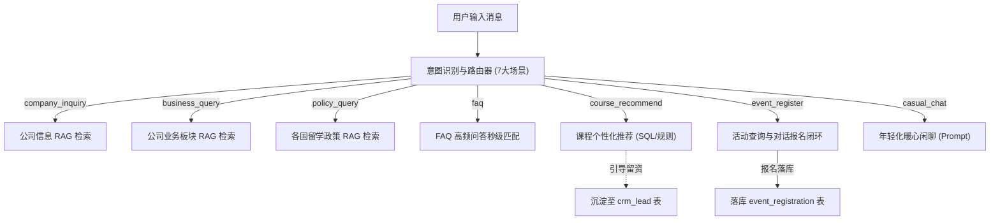

# 教育服务系统 · 客服 Agent 模块开发实施与 AI 指挥全景手册

> **文档定位**：本手册为“客服 Agent 模块”的最高优先级指导文档。当开发者或 AI 助手在目标代码仓库（含既有前后端脚手架）中执行开发时，**必须无条件遵照本手册中的业务规范、架构约束、执行顺序与指挥提示词**开展工作。

---

## 目录

1. [项目背景与既有架构对齐规范](#一项目背景与既有架构对齐规范)
2. [客服 Agent 7 大场景全功能需求规格说明](#二客服-agent-7-大场景全功能需求规格说明)
3. [核心数据表结构与字段字典](#三核心数据表结构与字段字典)
4. [知识库与 FAQ 静态数据源](#四知识库与-faq-静态数据源)
5. [Git 协同防污染与 .gitignore 规范（严防误提交）](#五git-协同防污染与-gitignore-规范严防误提交)
6. [AI 执行铁律与质量门禁（必须严格遵循）](#六ai-执行铁律与质量门禁必须严格遵循)
7. [分阶段实施路径与标准指挥提示词](#七分阶段实施路径与标准指挥提示词)
   - [阶段 0：仓库与架构探测（对齐已有脚手架）](#阶段-0仓库与架构探测对齐已有脚手架)
   - [阶段 1：后端代码实现与单元验证（Backend First）](#阶段-1后端代码实现与单元验证backend-first)
   - [阶段 2：前端界面实现与交互联调（Frontend Second）](#阶段-2前端界面实现与交互联调frontend-second)
   - [阶段 3：Dify 平台对接与工作流编排（Dify Third）](#阶段-3dify-平台对接与工作流编排dify-third)
8. [阶段性项目交付文档模板](#八阶段性项目交付文档模板)

---

## 一、项目背景与既有架构对齐规范

### 1.1 业务定位
本项目为一家综合留学教育服务机构（粤教服务）打造智能化业务支持平台。
**客服 Agent** 是该平台唯一面向外部访客/学员的核心对话机器人，负责提供咨询、解答政策、推荐课程、完成讲座报名，并沉淀高意向客户线索。

### 1.2 对齐已有脚手架的原则（重要！）
1. **不要推倒重来**：目标仓库中已有整体前后端框架（通常为 FastAPI / Python 后端 + Vue/React 前端），AI 在动工前必须先扫描既有项目的目录结构、ORM 规范、Base Model、路由注册方式与前端组件规范，**完全遵循既有代码风格和依赖**进行拓展。
2. **模块隔离原则**：所有客服 Agent 的后端代码应内聚在专有子模块（如 `routers/customer_service/`、`services/customer_service/`），不破坏其他 4 个模块（客户研判、企业助手、学生助手、智能报告）的代码结构。
3. **技术分工边界**：
   - **Dify**：负责“想”（意图识别、复杂工作流编排、大模型对话、知识库切片问答）。
   - **后端（FastAPI 等）**：负责“做”（业务增删改查、提供 Custom Tool API、活动名额校验、落库与上下文管理）。
   - **MySQL**：负责“记”（会话记录、课程项目、讲座活动、报名流水）。

---

## 二、客服 Agent 7 大场景全功能需求规格说明

所有 7 个场景必须 100% 完整实现，不可阉割：



| 场景 | 意图代码 (`intent_code`) | 触发特征与用户意图 | 核心业务处理与输出 | 降级与防幻觉策略 |
| :--- | :--- | :--- | :--- | :--- |
| **01 公司信息咨询** | `company_inquiry` | 询问机构背景、发展历程、资质、校区分布、成功案例 | 检索企业信息知识库，组织清晰严谨的品牌答复。 | 未命中时回复“关于该信息请以官方最新公告为准，或留下您的联系方式由专属顾问为您解答”，绝不瞎编。 |
| **02 公司业务查询** | `business_query` | 咨询中德双元制、新加坡本硕、学历提升、语言培训等业务模式 | 检索业务文档，输出培养模式、周期（如2+2、0.5/1+2）、优势及适合人群。 | 结合客户背景引导其进一步匹配具体课程。 |
| **03 留学政策查询** | `policy_query` | 咨询德国/新加坡签证要求、工作签证、移民条件、申请截止门槛 | 检索留学政策文档，解读最新签证与工签政策（如德国欧标B1、双元制津贴等）。 | 声明政策时效性，提示以使领馆最新规定为准。 |
| **04 常见问题解答** | `faq` | 咨询申请流程、收费标准、退费政策、缴费对公银行账户等 | 毫秒级命中 36 条标准问答对，直接返回精准标准答案。 | 置信度低于阈值时流转至知识库检索或人工客服引导。 |
| **05 课程项目推荐** | `course_recommend` | 表述自身学历（初中/中专/高中/大专/本科）、意向国家、预算范围 | 依据匹配规则，从 `course_project` 表筛选匹配度最高的前 1~3 个项目，输出学制、学费、优势，并附带引导深度咨询话术。 | 若信息不全（如未提国家），主动反问追问客户意向。 |
| **06 活动报名闭环** | `event_register` | 询问近期讲座、分享会，或直接提出“我想报名XX活动” | **1. 查活动**：展示近期活动列表；<br>**2. 报活动**：收集/确认姓名与联系方式，落库 `event_registration`，增加已报名计数。 | 满额拦截；重复报名拦截并友好提示“您已成功报名，请勿重复提交”。 |
| **07 日常闲聊互动** | `casual_chat` | 打招呼、闲聊、情感倾诉、表达焦虑或无明确业务诉求 | 采用亲切、可爱、温暖且符合年轻人语境的人设（适度网络热梗与表情），维系客户黏性。 | 适时在 3~5 轮闲聊后自然插入一句关切与留学意向引导。 |

---

## 三、核心数据表结构与字段字典

必须与 `db_init.sql` 中的 7 张核心表完全一致（若目标数据库已建表则直接映射 ORM，未建表则执行对应 DDL）：

### 3.1 会话与消息表
- **`chat_session`**：`id`, `session_id`(唯一索引), `user_id`, `visitor_name`, `visitor_contact`, `status`('active','closed','timeout'), `last_message_time`, `create_time`, `close_time`
- **`chat_message`**：`id`, `session_id`, `role`('user','assistant','system'), `content`, `intent`(7大场景代码), `tokens_used`, `response_time_ms`, `create_time`

### 3.2 业务数据表
- **`course_project`**：`id`, `project_name`, `category`('双元制教育'/'学历提升'/'国际本硕'等), `description`, `target_audience`, `price`, `duration`, `tags`(JSON数组), `status`(1上架 0下架)
- **`event_lecture`**：`id`, `event_name`, `event_type`('online'/'offline'/'hybrid'), `description`, `start_time`, `end_time`, `location`, `max_participants`, `current_participants`, `organizer_id`, `status`('upcoming'/'ongoing'/'ended'/'cancelled')
- **`event_registration`**：`id`, `event_id`, `user_id`, `customer_name`, `contact_info`, `status`('registered'/'attended'/'cancelled'/'no_show'), `remark`, `create_time`（联合唯一键 `uk_event_user(event_id, user_id)` 或根据手机号防重）

### 3.3 知识与配置表
- **`knowledge_base`**：`id`, `category`('company_info'/'business'/'policy'/'faq'/'overseas_life'), `title`, `content`, `source_file`, `chunk_index`, `embedding_vector`(BLOB/向量), `status`(1启用)
- **`intent_config`**：`id`, `intent_code`, `intent_name`, `scene`('customer_service'), `system_prompt`, `routing_rule`(JSON), `status`(1启用)

---

## 四、知识库与 FAQ 静态数据源

### 4.1 核心文档清单
1. **《企业信息.docx》/《公司新人指南.docx》**：广东教育国际交流服务中心有限公司（粤教国际/粤教服务）品牌背景、部门架构（双元制事业部、智能装备、课后服务等）、资质。
2. **《中德精英人才共建计划.docx》**：德国双元制职业教育、欧标B1要求、带薪实训（企业与政府共担费用）、医疗/机械/电子/汽车服务专业。
3. **《新加坡国际本硕升学计划.docx》**：2+2国际本科班、0.5/1+2本科班、1年制专升本/本升硕、带薪实习（薪资6000-8000）、中留服学历认证、广发银行对公缴费账户。
4. **《德国留学政策指南.docx》与《新加坡留学政策指南.docx》**：两国最新签证与落户/工作许可政策。

### 4.2 高频 FAQ 对（节选高频 10 条示例，完整数据共 36 条）
- **公司简称**：简称“粤教服务”，隶属于广东教育国际交流服务中心有限公司（粤教国际）。
- **对公缴费账户**：账户名称：广东省教育服务有限公司；账号：9550889900011455492；开户行：广发银行广州华夏路支行。
- **德国双元制学费与补贴**：培训费用由企业和国家共同承担，企业每月向培训生发放津贴，国家承担职业学校开支。
- **专升本/本升硕学制**：专升本只需 1~1.5 年，本升硕仅需 1 年，受中国教育部留学服务中心认证。

---

## 五、团队级代码与 Git 提交铁律（对齐组内 `edu-git-convention` 规范）

本模块开发必须**无条件执行组内硬性规范**，每一行代码和每一次提交都必须达到免检标准：

### 5.1 变量与代码命名铁律
1. **纯英文，严禁拼音**：严禁出现 `kehu`、`kefu`、`xuesheng` 等拼音缩写；表名与字段严格映射 `db_init.sql`（snake_case），不得擅自改动。
2. **禁止语义空洞命名**：严禁单用 `data`、`info`、`result`、`temp`、`flag` 等词，必须明确语义：
   - 错误：`data = get_data()`，正确：`course_list = get_course_projects()`
   - 错误：`result = parse()`，正确：`matched_intents = classify_intent()`
3. **布尔变量强制前缀**：必须且只能以 `is_` 或 `has_` 开头（如 `is_registered`、`has_quota`、`is_active`）。
4. **命名格式统一**：
   - 变量/函数：`snake_case`（如 `recommend_courses`）
   - 类名：`PascalCase`（如 `CustomerServiceAgent`, `KnowledgeBaseService`）
   - 常量：`UPPER_SNAKE_CASE`（如 `MAX_RECOMMEND_COUNT = 3`）

### 5.2 Git 提交与分支规范（客服模块码：`cs`）
1. **严禁在 `main` / `develop` 直接提交代码**：
   - 必须基于最新 `develop` 签出功能分支：`feature/cs-<任务卡号>-<简述>`（例如：`feature/cs-01-knowledge-base`、`feature/cs-04-intent-router`）。
2. **提交信息强制格式**：`类型(cs): 动词开头的一句话`
   - `feat(cs): 新增知识库检索与FAQ匹配接口`
   - `feat(cs): 新增课程个性化推荐与条件匹配接口`
   - `feat(cs): 实现活动查询与报名落库闭环`
   - `fix(cs): 修复活动重复报名状态校验异常`
   - `test(cs): 补充客服7大场景意图分类测试用例`
3. **小步提交，精准 `git add`**：
   - 严禁 `git add .`！只提交客服模块所属文件（如 `app/routers/customer_service/`）；
   - 提交前必须执行 `git status` 自查暂存区。

### 5.3 现有 `.gitignore` 基础上的补充（仅需 2 行）
针对项目已有 `.gitignore`，仅需在末尾追加以下两行，防范 Windows 下 Office 的临时锁文件与素材泄露：

```gitignore
# 客服 Agent 本地原始资料与临时文件（防污染）
~$*
docs/raw_materials/
```

---

## 六、AI 执行铁律与质量门禁（必须严格遵循）

1. **执行顺序不可颠倒**：
   - **第 1 步：后端工程代码**（先跑通接口与业务逻辑闭环）
   - **第 2 步：前端交互界面**（对齐视觉与组件，完成前后端联调）
   - **第 3 步：Dify 平台编排与对接**（提供 Tool OpenAPI 规范与 DSL 配置）
2. **严格遵守 `edu-git-convention`**：
   - 分支必须以 `feature/cs-` 开头，提交必须为 `feat(cs):` / `fix(cs):` 格式；
   - 变量严格命名（纯英文、无空洞名、布尔带 `is_`/`has_`）。
3. **逐项开发与立即自测**：
   - 每写完一个功能（例如活动报名接口），必须立刻编写或运行自动化测试代码进行验证，确认 100% 成功无误后，才可进入下一个小功能。
4. **长程任务上下文整理**：
   - 每完成一个功能小项，整理一次已完成清单、变更文件及当前状态，防止长程任务上下文遗忘或漂移。
5. **大模块暂停请示与交付文档**：
   - 每完成一个大模块（如大模块 1 后端全部通过测试），**必须暂停一切代码修改，撰写对应的阶段性项目交付文档，向用户汇报并等待下一步指令**。
6. **杜绝猜测，直接确认**：
   - 遇到任何未提及的配置、密码、端口、命名冲突等疑问，**立即向用户提问确认，严禁自行假设**。

---

## 六、分阶段实施路径与标准指挥提示词

> **使用方法**：用户将本手册放置于实际项目工程根目录下。在与 AI 的对话中，可直接复制以下各阶段的【指令提示词】发送给 AI 执行。

---

### 阶段 0：仓库与架构探测（对齐已有脚手架）

#### 【指令提示词 0】
```text
你现在是本项目客服Agent模块的首席工程师。请先通读根目录下的《客服Agent模块-开发实施与AI指挥手册.md》。
本仓库已有整体项目的脚手架、前后端框架与数据库连接配置。
请先完成【阶段 0：架构与环境探测】，不要修改任何业务代码：
1. 扫描并向我报告当前仓库的目录结构、后端框架（如FastAPI/Flask/Django）、ORM与数据库连接配置方式、前端框架与UI技术栈；
2. 检查既有代码中是否有客服Agent的已有文件或数据模型；
3. 规划客服Agent模块在既有工程中的落脚目录（如后端路由、服务层、模型层及前端组件路径），确保完全契合既有架构风格；
4. 整理探测报告并向我确认，等待我的指令后再开始阶段 1（后端开发）。遇到任何不明确的配置直接向我提问，严禁自行假设。
```

---

### 阶段 1：后端代码实现与单元验证（Backend First）

包含 6 个独立功能小项，严格逐一实现并自测：
- **1.1 数据模型与迁移**：`ChatSession`, `ChatMessage`, `CourseProject`, `EventLecture`, `EventRegistration`, `KnowledgeBase`, `IntentConfig`。
- **1.2 知识库与 FAQ 检索引擎**：结构化切片入库、混合检索接口、36条FAQ秒级精准匹配。
- **1.3 课程与项目智能推荐接口**：按学历、预算、国家条件匹配与推荐理由生成。
- **1.4 活动查询与报名闭环接口**：活动列表拉取、报名落库、名额校验、重复报名拦截。
- **1.5 7 大意图识别与会话调度引擎**：意图分类、年轻化闲聊提示词、多轮对话流转。
- **1.6 单元测试与端到端自动化验证**：覆盖 7 大场景的自动化测试用例。

#### 【指令提示词 1】
```text
请开始执行【阶段 1：客服Agent后端代码实现】。严格遵循“每个功能独立开发、完成后立即测试验证无误再进入下一个”的铁律：

请按以下顺序逐步开发与验证：
1. 实现 1.1 数据模型（ORM模型与Pydantic Schema），对齐手册中的字段规范并验证连通性；
2. 实现 1.2 知识库与FAQ检索服务及API，灌入3份核心文档切片与36条问答对，测试检索召回与置信度；
3. 实现 1.3 课程与项目推荐服务及API（POST /recommend），测试学历与预算匹配规则；
4. 实现 1.4 活动查询与对话报名闭环API（GET /events, POST /register），测试名额校验与防重；
5. 实现 1.5 客服会话引擎与7大意图识别路由器（POST /chat），接入年轻化闲聊人设与多轮上下文；
6. 编写并运行自动化测试脚本，全面验证上述所有接口。

【质量门禁与暂停要求】：
每完成一个小项在控制台输出测试结果。阶段 1 全部功能测试通过后，请立即暂停，生成《客服Agent模块·阶段交付文档（一）后端API与业务引擎.md》，并向我汇报等待我的指令，严禁直接开始前端开发！
```

---

### 阶段 2：前端界面实现与交互联调（Frontend Second）

包含 4 个独立功能小项：
- **2.1 现代化 WebChat 基础聊天流**：气泡交互、打字机效果、头像人设、响应式主题。
- **2.2 结构化业务卡片组件**：课程推荐卡片（学费/学制/立即咨询）、活动报名交互卡片与预约弹窗。
- **2.3 来源引用展示与 FAQ 快捷抽屉**：展示知识库来源引用，提供常见问题快捷点击秒回。
- **2.4 前后端联调与完整对话流打通**：与后端接口对接，消除任何跨域与交互卡顿。

#### 【指令提示词 2】
```text
后端代码与测试已全部验收通过，现在开始执行【阶段 2：客服Agent前端界面实现与联调】：

请遵循既有前端框架规范（如Vue/React或现代化Web组件）：
1. 实现 2.1 WebChat 基础聊天界面，支持会话创建、历史加载、消息流式打字与年轻化客服人设展示；
2. 实现 2.2 结构化业务卡片：实现课程推荐展示卡片与讲座活动报名卡片/弹窗，在对话内直接完成表单提交闭环；
3. 实现 2.3 来源引用徽标与 FAQ 快捷提问抽屉，支持一键发送高频问题；
4. 进行前后端全链路交互联调，确保 7 大场景在前端均能顺畅交互，无报错。

【质量门禁与暂停要求】：
完成所有组件并验证 7 大场景视觉与交互无误后，请立即暂停，生成《客服Agent模块·阶段交付文档（二）前端交互界面与组件.md》，向我汇报并等待我的指令，严禁直接进入 Dify 对接！
```

---

### 阶段 3：Dify 平台对接与工作流编排（Dify Third）

包含 3 个独立功能小项：
- **3.1 Dify OpenAPI 自定义工具配置**：将课程推荐、活动查询与报名接口封装为 Dify OpenAPI 3.0 工具 Schema。
- **3.2 Dify 工作流编排配置（DSL）**：编排 7 意图分类器、知识库检索节点、Custom Tool 调用节点与年轻化人设节点。
- **3.3 全链路闭环验收与试错记录**：模拟真实客户场景全链路跑通，记录优化点与试错经验（用于答辩）。

#### 【指令提示词 3】
```text
前端与后端均已独立验证无误，现在开始执行【阶段 3：Dify平台对接与工作流编排】：

请完成以下任务：
1. 生成符合 Dify 规范的 OpenAPI 3.0 Custom Tool 描述文件（yaml/json），将后端的课程推荐、活动查询及报名闭环接口完整暴露；
2. 编写或导出 Dify Agent / Workflow 编排配置（DSL文件），包含 7 大意图路由判断节点、知识库检索挂载与工具调用分支；
3. 配置客服年轻化人设与防幻觉兜底 Prompt；
4. 编写全链路端到端验收脚本，输出《客服Agent模块·阶段交付文档（三）Dify对接与全链路交付手册.md》，并附带答辩必备的“试错日志与架构权衡分析”。
完成后向我做最终交付汇报。
```

---

## 七、阶段性项目交付文档模板

依据项目《答辩所需文本交付物清单.txt》与《开发引导new.md》规范，每阶段输出的交付文档必须包含以下标准章节：

```markdown
# 客服 Agent 模块 · 阶段交付文档（第 X 阶段：XXXX）

## 1. 本阶段完成的功能清单与对应任务卡
| 任务编号 | 功能描述 | 对应文件/接口 | 验收状态 |
|---|---|---|---|
| CS-01 | 知识库切片与检索 | ... | ✅ 已验证 |
| ... | ... | ... | ✅ 已验证 |

## 2. 接口与数据表设计说明
- 新增/变更的接口路径、入参、出参示例
- 对应数据表及字段更新

## 3. 测试验证记录与用例执行结果
- 自动化测试用例输出日志（包含成功断言截图或文本）
- 7 大意图场景测试覆盖表现

## 4. 试错日志与避坑记录（答辩核心素材）
- 遇到的技术卡点或预期不一致问题
- 排查思路、尝试过的方案（含失败尝试）
- 最终解决方案与思考沉淀

## 5. 下一阶段工作计划与风险评估
- 下一阶段前置依赖检查
- 潜在风险与应对预案
```
