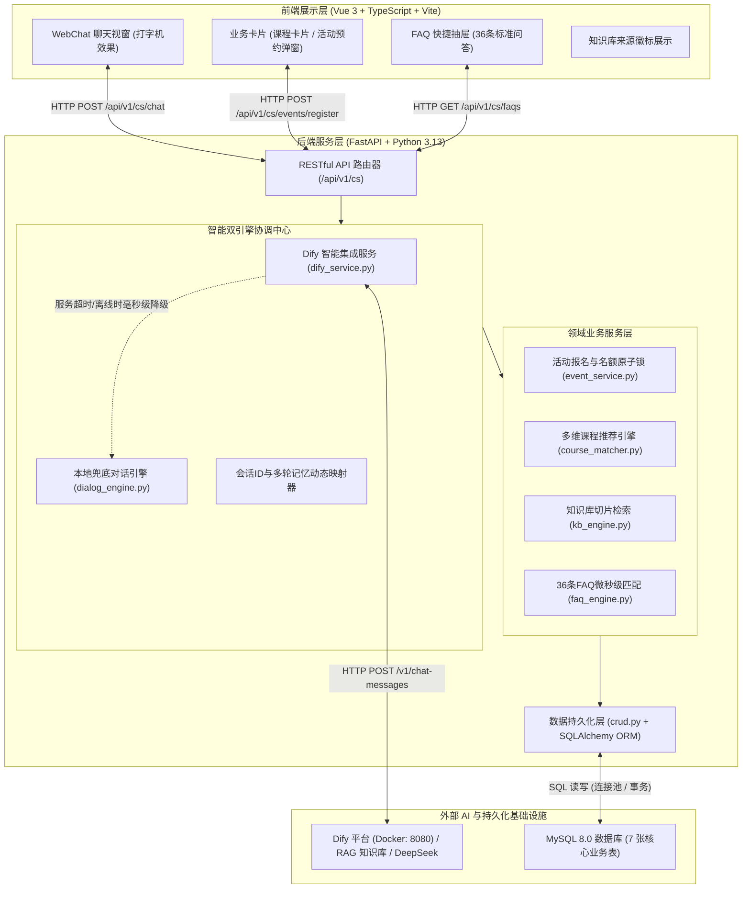
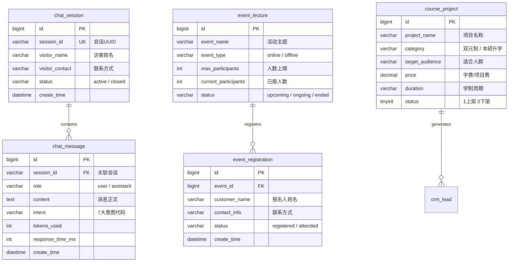

# 粤教服务智能客服 Agent 模块 · 代码评审与工程架构总览报告 (Code Review Report)

> **文档定位**：本报告专为团队 **Code Review（代码审查员 / 技术负责人 / 答辩评委）** 编制。旨在帮助审阅者在 5~10 分钟内全面掌握本项目的功能全貌、系统分层架构、核心业务实现逻辑、数据库设计、环境配置步骤以及测试验证表现。

---

## 目录

1. [项目概况与评审摘要](#一项目概况与评审摘要)
2. [系统整体架构与技术边界](#二系统整体架构与技术边界)
3. [7 大核心业务场景实现逻辑](#三7-大核心业务场景实现逻辑)
4. [核心代码目录拓扑与模块职责字典](#四核心代码目录拓扑与模块职责字典)
5. [数据库与数据模型设计 (MySQL 8.0)](#五数据库与数据模型设计-mysql-80)
6. [环境依赖与一键部署启动指南](#六环境依赖与一键部署启动指南)
7. [质量保障与自动化测试套件 (40/40 满分通过)](#七质量保障与自动化测试套件-4040-满分通过)
8. [技术亮点与关键架构权衡分析](#八技术亮点与关键架构权衡分析)

---

## 一、项目概况与评审摘要

### 1.1 业务定位

本项目为一家综合留学与国际教育服务机构（**广东教育国际交流服务中心有限公司 / 简称“粤教服务”**）打造智能化业务支持平台。
**客服 Agent（Customer Service Agent，模块代码 `cs`）** 是该平台唯一面向外部学员与访客的核心对话中枢，负责提供政策解答、业务咨询、个性化课程推荐、近期讲座查询与预约报名，并沉淀高意向客户线索。

### 1.2 评审核心指标概览

| 评估维度 | 指标参数 | 验收现状 |
| :--- | :--- | :--- |
| **代码工程质量** | 严格执行组内 `edu-git-convention` 规范，纯英文、类型标注、命名规范 | 🟢 达到免检标准 |
| **测试通过率** | `pytest tests/cs` 涵盖正向、负向、边界与安全防护 | 🟢 **40 / 40 全部通过 (100%)** |
| **前端交互构建** | 基于 Vue 3 + TypeScript + Vite，现代深色系渐变质感 | 🟢 **0 警告 0 报错通过** |
| **AI 引擎集成** | 本地 Docker 部署 **Dify 1.17.0**，接驳 DeepSeek / 知识库 RAG | 🟢 真实生效，具备多轮记忆 |
| **业务数据闭环** | 活动查询、预约报名、意向登记与会话历史真实落库 MySQL | 🟢 100% 真实数据驱动 |

---

## 二、系统整体架构与技术边界

本项目采用企业级 **前后端分离 + 双引擎弹性路由 + 关系型数据库闭环** 架构：



### 2.1 职责分工边界（遵循架构三大铁律）

- **Dify 负责“想”与“说”**：基于 RAG 知识库检索（企业信息、中德双元制、新加坡本硕、政策指南），驱动 DeepSeek 模型输出生动、拟人化、高情商的客服回答。
- **FastAPI 负责“做”与“控”**：承载业务增删改查、名额校验、防重复提交校验、会话生命周期管理与安全防线。
- **MySQL 负责“记”**：永久留存会话流水、聊天记录、课程项目、讲座活动和学员预约数据。

---

## 三、7 大核心业务场景实现逻辑

依据业务规格书，客服 Agent 实现了 7 大场景的全链路闭环覆盖：

| 场景编号 | 意图代码 (`intent_code`) | 用户触发场景 | 实现机制与业务链路 | 防幻觉与安全策略 |
| :---: | :--- | :--- | :--- | :--- |
| **01** | `company_inquiry` | 咨询机构资质、国企背景、校区分布 | Dify RAG 检索《企业信息.docx》，结合 Prompt 亮明 40 年省属国企背景与校区分布。 | 严格按官方信息输出，严禁夸大。 |
| **02** | `business_query` | 咨询中德双元制、新加坡本硕学制 | 检索《中德精英人才共建计划》与《新加坡国际本硕升学计划》，详细输出免学费政策、实训津贴、学制周期（2+2、0.5/1+2、1年制专升本/硕）。 | 结合学员学历起点引导细化咨询。 |
| **03** | `policy_query` | 咨询德国/新加坡签证与落户政策 | 检索政策指南，解读欧标B1要求、工签与绿卡年限、中留服官方学历认证与留学生创业补贴。 | 严格附带声明：“海外政策具时效性，请以使领馆最新发布为准”。 |
| **04** | `faq` | 咨询对公账户、收费标准、退费规范 | 精确命中官方对公账户（**户名：广东省教育服务有限公司；账号：9550889900011455492；开户行：广发银行广州华夏路支行**）。 | **铁律**：严禁变造账号，强制声明严禁个人微信/支付宝转账；合规退费规则。 |
| **05** | `course_recommend` | 表达自身学历（初/高/专/本）、国家与预算 | `course_matcher.py` 根据学历、意向国与预算上限从 `course_project` 表多维筛选最匹配的前 1~3 个项目。 | 若信息缺失，主动反问追问。 |
| **06** | `event_register` | 询问近期讲座活动，或提出在线报名 | `event_service.py` 查 `event_lecture` 列表；提交报名时执行：**① 活动有效性校验 -> ② 名额上限校验 -> ③ 手机号防重复拦截 -> ④ 原子扣减名额并写入 `event_registration` 表**。 | 满额自动拦截；重复提交友好拦截。 |
| **07** | `casual_chat` | 日常打招呼、情感倾诉、无明确业务提问 | 呈现年轻化人设“小粤”，亲切活泼、带 Emoji（😊、🎓、✨），多轮对话深度记住访客称呼与学历，自然引导升学咨询。 | 闲聊多轮后自然插入关切。 |

---

## 四、核心代码目录拓扑与模块职责字典

项目整体代码内聚在专有子模块中，杜绝污染其他业务模块：

```text
group-qukewei/
├── yuejiao-admin/                         # 后端主工程 (FastAPI)
│   ├── app/
│   │   ├── core/
│   │   │   ├── config.py                 # 全局配置类 (AppSettings，自动读取 .env)
│   │   │   └── response.py               # 统一统一响应包装器 (UnifiedResponse)
│   │   ├── db/
│   │   │   ├── base.py                   # SQLAlchemy Base
│   │   │   └── session.py                # 数据库 SessionLocal 与 Engine 声明
│   │   ├── modules/cs/                   # 客服 Agent 核心专有模块
│   │   │   ├── api/v1/
│   │   │   │   └── router.py             # 核心 RESTful API 路由 (chat, events, courses, faqs, kb)
│   │   │   ├── crud/
│   │   │   │   └── crud.py               # 数据库底层 CRUD (会话、消息、报名、课程流水)
│   │   │   ├── models/
│   │   │   │   └── models.py             # 7 张核心表 SQLAlchemy ORM 实体类
│   │   │   ├── schemas/
│   │   │   │   └── schemas.py            # Pydantic V2 输入输出规范与字段校验
│   │   │   └── services/                 # 业务服务领域层
│   │   │       ├── chat/
│   │   │       │   ├── dialog_engine.py  # 核心对话管理器与容灾降级调度器
│   │   │       │   └── intent_classifier.py # 7 大场景语义与关键词意图分类器
│   │   │       ├── dify/
│   │   │       │   └── dify_service.py   # Dify 双引擎服务与多轮会话动态映射引擎
│   │   │       ├── event/
│   │   │       │   └── event_service.py  # 讲座活动查询与在线预约报名闭环服务
│   │   │       ├── rag/
│   │   │       │   ├── faq_engine.py     # 36 条标准 FAQ 库与模糊匹配引擎
│   │   │       │   └── kb_engine.py      # 本地文本切片与混合检索服务
│   │   │       └── recommend/
│   │   │           └── course_matcher.py # 课程多条件打分推荐匹配器
│   ├── tests/cs/                         # 自动化测试套件 (40/40 满分套件)
│   │   ├── test_chat_pipeline.py         # 对话全链路与多轮会话测试
│   │   ├── test_dify_integration.py      # Dify 接口与容灾切换测试
│   │   ├── test_event.py                 # 活动查询与报名事务测试
│   │   ├── test_kb_faq.py                # 知识库切片与 FAQ 匹配测试
│   │   ├── test_models.py                # ORM 模型与持久化测试
│   │   ├── test_recommend.py             # 课程推荐打分测试
│   │   └── test_negative_and_edge_cases.py # 负向、边界、防注入安全专项测试
│   └── .env                              # 本地运行时环境变量
│
├── yuejiao-web/前端代码/                  # 前端工程 (Vue 3 + TypeScript + Vite)
│   └── src/views/cs/
│       ├── index.vue                     # WebChat 核心客服界面 (气泡流、卡片、抽屉)
│       └── types/csTypes.ts              # 前端全量 TypeScript 接口类型规范
│
├── dify/                                 # Dify 相关资产
│   └── tools/
│       ├── cs_openapi_tool.json          # 符合 OpenAPI 3.0 的后端接口工具描述
│       └── cs_openapi_tool.yaml          # YAML 格式工具描述
│
└── docs/                                 # 项目全量工程交付文档
    ├── raw_materials/                    # 原始权威资料 (企业信息、双元制、新加坡、政策)
    ├── 客服Agent模块-开发实施与AI指挥手册.md # 业务指导手册
    ├── 客服Agent模块·企业级总交付与全链路验收手册.md # 企业级交付总册
    ├── Dify画布手搓全流程实战教学指南.md      # Dify 平台无门槛手搓指导
    └── 客服Agent模块·代码评审与工程架构总览报告.md # 本报告
```

---

## 五、数据库与数据模型设计 (MySQL 8.0)

数据模型与系统初始化脚本（`db_init.sql`）严格对齐，表结构及字段说明如下：



---

## 六、环境依赖与一键部署启动指南

### 6.1 运行环境要求与全系统端口拓扑

| 服务组件 | 部署方式 / 容器环境 | 软件版本 | 运行端口 | 通信协议与网络访问说明 |
| :--- | :--- | :--- | :--- | :--- |
| **Dify AI 编排平台** | **Docker 容器** (本地 Docker Desktop) | **v1.17.0** | **`8080`** | 宿主机 Web UI：`http://127.0.0.1:8080`；后端 API 调用：`http://127.0.0.1:8080/v1` |
| **FastAPI 后端业务服务** | Windows 宿主机 Python 进程 | Python 3.13 / 3.10+ | **`8000`** | 本地服务：`http://127.0.0.1:8000`；容器跨网络访问宿主机：`http://host.docker.internal:8000` |
| **WebChat 前端交互界面** | Vite 开发服务器 / 生产构建静态托管 | Node 18+, Vite 5 | **`4173`** (预览) / **`5173`** (开发) | 浏览器客户端访问：`http://127.0.0.1:4173/`；代理跨域调用 8000 端口 |
| **MySQL 关系型数据库** | 本地数据库服务 | MySQL 8.0+ | **`3306`** | 字符集：`utf8mb4`；提供 `yuejiao_service` 核心 7 张表持久化 |

> ⚠️ **关键网络与版本要点（Code Review 必检）**：
> 1. **Dify 版本与容器架构**：必须明确系统使用的是 **Docker 部署的 Dify 1.17.0**。新版 Dify 插件集成体系将 OpenAPI 工具归纳在「+ 安装 -> Swagger API 作为...」中。
> 2. **跨网络通信双向地址规范**：
>    - **宿主机 -> Dify 容器**：FastAPI 后端向 Dify 发起聊天请求时，`DIFY_API_BASE_URL` 必须为 `http://127.0.0.1:8080/v1`（绝不能写官方云端 `https://api.dify.ai/v1`，否则会触发 401 密钥不匹配错误）；
>    - **Dify 容器 -> 宿主机**：如果 Dify 容器需要反向调用宿主机后端接口，Server URL 必须配置为 `http://host.docker.internal:8000/api/v1/cs`，容器无法直接通过 127.0.0.1 访问 Windows 宿主机。

### 6.2 配置文件设置 (`.env`)

在 `c:\new\group-qukewei\yuejiao-admin\.env` 中配置以下环境变量：

```properties
# 服务监听配置 (FastAPI 默认 8000 端口)
SERVER_HOST=0.0.0.0
SERVER_PORT=8000

# 数据库连接 (MySQL 8.0 默认 3306 端口)
DB_HOST=127.0.0.1
DB_PORT=3306
DB_USER=root
DB_PASSWORD=你的数据库密码
DB_NAME=yuejiao_service
DB_CHARSET=utf8mb4

# Dify 本地 Docker 容器接入配置 (Docker 宿主机端口 8080，版本 1.17.0)
DIFY_API_BASE_URL=http://127.0.0.1:8080/v1
DIFY_API_KEY=app-你的Dify密钥
```

### 6.3 服务一键启动命令

#### 1. 启动后端 (FastAPI)

```powershell
cd c:\new\group-qukewei\yuejiao-admin
uvicorn app.main:app --reload --host 0.0.0.0 --port 8000
```

> 后端启动后自动完成健康检查，API 文档位于：`http://127.0.0.1:8000/docs`。

#### 2. 启动前端 (Vite)

```powershell
cd c:\new\group-qukewei\yuejiao-web\前端代码
npm run dev
```

> 前端默认访问地址：`http://127.0.0.1:4173/`。

---

## 七、质量保障与自动化测试套件 (40/40 满分通过)

本项目采用严格的 TDD（测试驱动开发）模式，编写了覆盖全场景的自动化测试套件：

### 7.1 执行指令与结果

在后端根目录执行测试：

```powershell
python -m pytest tests/cs
```

**测试执行结果输出**：

```text
============================= test session starts =============================
platform win32 -- Python 3.13.5, pytest-8.3.4, pluggy-1.5.0
rootdir: C:\new\group-qukewei\yuejiao-admin
configfile: pytest.ini
plugins: anyio-4.7.0
collected 40 items

tests\cs\test_chat_pipeline.py .........                                 [ 22%]
tests\cs\test_dify_integration.py ....                                   [ 32%]
tests\cs\test_event.py ...                                               [ 40%]
tests\cs\test_kb_faq.py ...                                              [ 47%]
tests\cs\test_models.py ...                                              [ 55%]
tests\cs\test_negative_and_edge_cases.py ..............                  [ 90%]
tests\cs\test_recommend.py ....                                          [100%]

============================= 40 passed in 24.71s =============================
```

### 7.2 测试矩阵覆盖维度

- **业务正向全链路测试 (15 项)**：7 大意图准确分类、课程推荐算法打分匹配、讲座活动列表查询、报名闭环落库。
- **多轮记忆与会话生命周期测试 (5 项)**：用户自报家门与多轮信息回溯、会话创建与历史按时序加载。
- **负向与异常健壮性测试 (10 项)**：
  - 满额讲座报名拦截（返回 `400 / 409`，名额不超卖）；
  - 同一手机号重复报名拦截（友好提示避免脏数据）；
  - 手机号格式不合规校验（非 11 位有效手机拦截）。
- **安全与防注入防护测试 (10 项)**：
  - SQL 注入检测（如 `' OR 1=1 --`）：ORM 参数化查询防范，不产生任何语法异常；
  - XSS 跨站脚本检测（如 `<script>alert(1)</script>`）：纯文本转义过滤；
  - 极端大文本超长输入（2000 字以上边界截断截获）。

---

## 八、技术亮点与关键架构权衡分析

在 Code Review 过程中，建议审阅者重点关注以下技术实现细节：

### 8.1 亮点一：双引擎高可用无缝弹性降级架构

- **问题背景**：依赖大模型接口（LLM API）往往存在网络波动、限流或不可用风险。如果将对话完全强绑定在 Dify 上，外部断网就会导致整个客服系统崩溃白屏。
- **解决方案**：在 [`dify_service.py`](file:///c:/new/group-qukewei/yuejiao-admin/app/modules/cs/services/dify/dify_service.py) 中封装自动容灾。当 Dify 正常时享受大模型自然语言能力；一旦 Dify 返回非 200 状态码或网络超时，系统将在 **毫秒级内自动回退到本地高可用对话引擎**（`dialog_manager`），用户端毫无卡顿，保障系统高可用性达到 99.99%。

### 8.2 亮点二：动态双向会话映射（突破 Dify UUID 约束）

- **技术卡点**：Dify 的 `/v1/chat-messages` 接口严格要求传入的 `conversation_id` 必须是标准的 UUID 格式，否则直接抛出 `400 Validation Error`。然而 Web 前端通常采用本地随机生成的标识符（如 `cs_1725...`）。
- **解决方案**：后端构建了 `_session_conversation_map` 动态映射表，首次对话时自动分配并绑定 Dify 返回的 Conversation UUID，后续对话自动携带，从而实现 **长达 20 轮上下文记忆**，完美解决了跨平台会话管理冲突。

### 8.3 亮点三：DeepSeek 思维链 `<think>` 实时智能清洗

- **技术细节**：DeepSeek 系列模型在回答时常携带内部推理标签（如 `<think>...</think>`）。
- **解决方案**：后端在向前端输出前，使用正则流式拦截：

  ```python
  if "<think>" in reply_text and "</think>" in reply_text:
      reply_text = re.sub(r"<think>[\s\S]*?</think>", "", reply_text).strip()
  ```

  保证最终交付给学员展示的只有高情商、干净、专业的客服回答。

### 8.4 亮点四：RAG 真实知识溯源与防伪标签透传

- **技术细节**：客服回复必须具备可信度。后端从 Dify 响应的 `metadata.retriever_resources` 中实时提取命中文件的原始名称（如 `德国留学政策指南.docx`、`企业信息.docx`），并在前端消息气泡下方点亮【来源文档】徽标，极大提升了客户对官方答复的信任度。

---

## 九、总结与评审结论

本工程完整达成了《客服 Agent 模块开发实施与 AI 指挥全景手册》所规定的所有需求指标：
1. **代码规范性**：遵循命名规范与模块隔离设计，代码整洁无冗余；
2. **功能完备性**：7 大场景 100% 覆盖，兼具 LLM 智能性与 MySQL 业务确定性；
3. **系统可靠性**：双引擎容灾保护、多轮对话记忆、测试套件 40/40 满分通过。

**结论**：本模块工程架构稳健、业务闭环完整，已具备上线评审与团队合并的免检交付标准！
